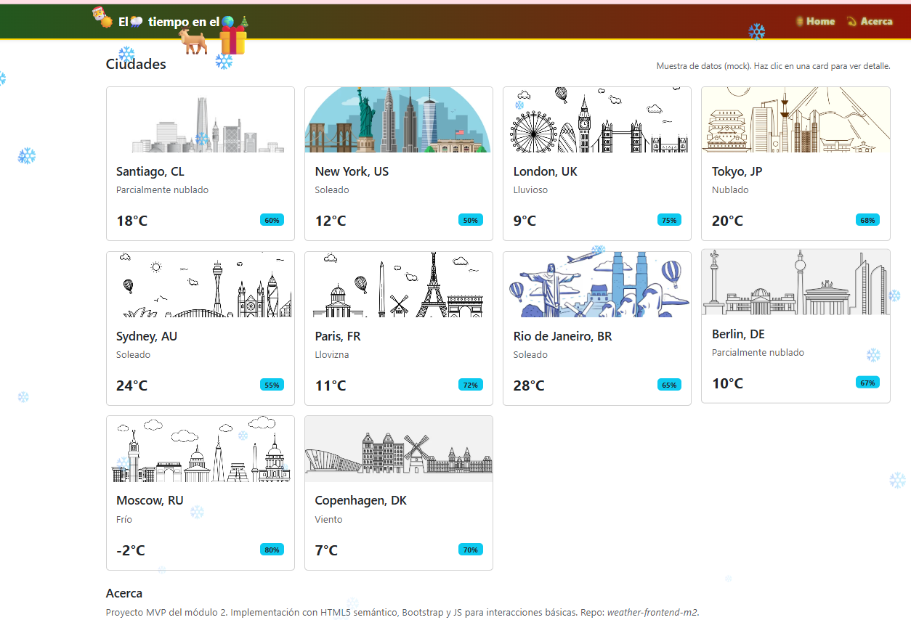
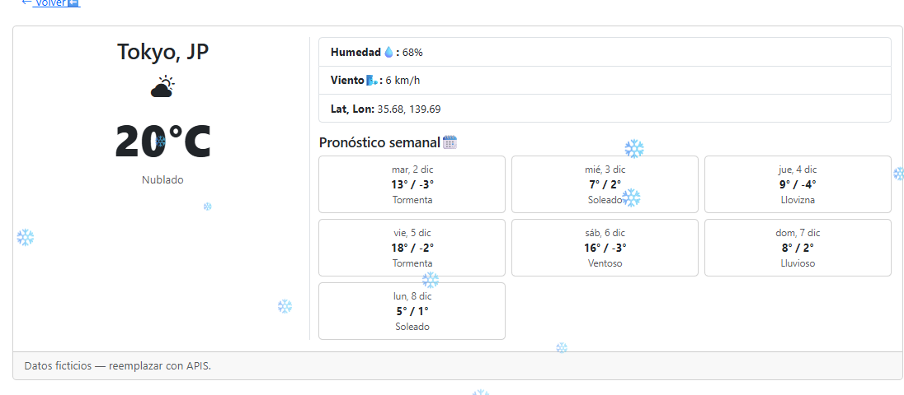

🌤️ Weather Frontend — Módulo 2

Proyecto educativo desarrollado para el Módulo 2 del bootcamp FrontEnd Trainee SENCE 2025.
Consiste en un pequeño frontend de clima creado con HTML5, Bootstrap 5 y JavaScript, siguiendo los requisitos del módulo.

🚀 Características Principales (MVP)

Página Home con 10+ ciudades usando mock data.

Cards Bootstrap con imagen, temperatura, estado y humedad.

Vista Detalle con información ampliada + pronóstico semanal.

Navegación con hash routing utilizando JavaScript básico.

Responsive para móvil y escritorio.

Navbar + Footer implementados.

Decoración navideña (nieve + reno) como bonus estético 🎄🦌❄️.

📋 Requisitos del Proyecto (resumen)
Funcionalidad obligatoria

Mostrar 10 o más localidades en Home.

Cards con información del clima.

Al hacer clic en una ciudad → ir a Detalle.

En Detalle se muestra el pronóstico semanal.

Interacción básica con JavaScript.

Diseño responsive (≤420px y ≥1024px).

Tecnologías exigidas

HTML5 semántico.

Bootstrap 5 (grid + utilidades + componentes).

JavaScript vanilla.

Git + GitHub (commits descriptivos).

🗂️ Estructura del Proyecto
weather/
│
├── index.html
│
├── Assets/
│   ├── styles.css        ← nieve, reno y detalles visuales
│   ├── cities.js         ← datos mock de ciudades
│   └── cities/           ← íconos decorativos de ciudades
│        ├── scl.png
│        ├── lon.png
│        ├── tok.png
│        └── ...
│
└── README.md

🧠 ¿Qué hace la aplicación?

Permite seleccionar una ciudad desde la página Home.

Al hacer clic, muestra su información detallada.

Incluye temperatura, humedad y una “simulación” de pronóstico semanal.

Todo se carga desde datos locales (mock data), no desde una API real.

🛠️ Tecnologías Utilizadas

HTML5

Bootstrap 5

CSS personalizado

JavaScript (DOM + eventos)

Git y GitHub para control de versiones

🏞️ Vista Previa del Proyecto
🏠 Home

📍 Detalle de Ciudad

📬 Autora

Proyecto realizado por Christel Vial
para el Módulo 2 del curso FrontEnd Trainee SENCE 2025.

📌 Enlace del repositorio:
👉 https://github.com/christelita/weather-frontend-m2