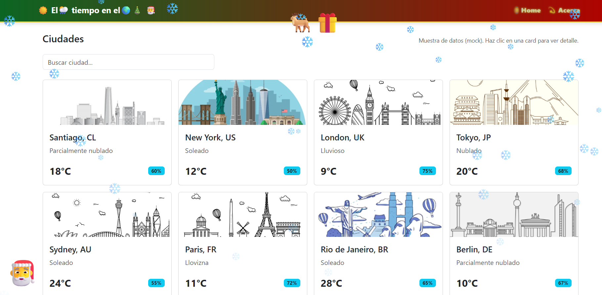
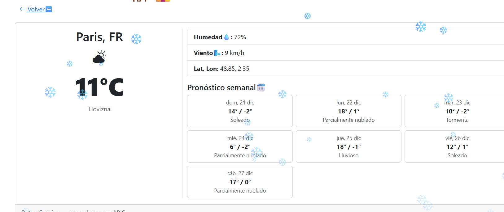

# 🌤️ Weather Frontend — (Módulo 3) Módulo 4

Proyecto educativo desarrollado para el **Módulo 3** del Bootcamp FrontEnd Trainee SENCE 2025.  
Esta versión refactoriza la **interfaz de la App de Clima** del Módulo 2, enfocándose en **estilos, layout y modularización CSS** usando **SASS, BEM y Bootstrap**.

---

## Descripción

Aplicación de clima que muestra información de 10 ciudades principales del mundo utilizando **datos ficticios (mock data)** definidos completamente en JavaScript.  
La app presenta temperatura actual, estado del tiempo, humedad, viento y un **pronóstico semanal simulado**, todo renderizado dinámicamente en el DOM.

En esta versión, además de la refactorización visual realizada en el Módulo 3, el proyecto incorpora un **foco claro en la lógica de programación** (Módulo 4): modelado de datos, uso de ciclos y condicionales, funciones reutilizables y cálculo de estadísticas semanales a partir del pronóstico diario.

La interfaz es clara, accesible y responsiva, con una estética climática animada y sobria, preparando la aplicación para futuras mejoras como alertas meteorológicas o conexión a una API real.


## Metodología de estilos

Se utilizó la metodología BEM (Bloque, Elemento, Modificador) para mantener los nombres de clases claros y consistentes en toda la app. Esto facilita el mantenimiento y la escalabilidad del CSS.

## 🚀 Características Principales (MVP)

- Página **Home** con grilla de ciudades generada dinámicamente desde JavaScript.
- Datos de clima modelados en un **arreglo de objetos** (`CITIES`).
- Cards con información de clima actual: icono, temperatura, estado y humedad.
- **Vista Detalle** con información ampliada de la ciudad seleccionada.
- Pronóstico semanal renderizado dinámicamente (día, mínima, máxima y estado).
- **Estadísticas semanales calculadas en JavaScript**:
  - Temperatura mínima, máxima y promedio de la semana.
  - Conteo de días por tipo de clima.
  - Resumen textual automático del clima semanal.
- Navegación entre vistas mediante **hash routing** (`#home`, `#city=id`).
- Barra de búsqueda que filtra ciudades en tiempo real.
- Layout **responsivo**:
  - Móvil (≤420px): cards apiladas.
  - Desktop (≥1024px): múltiples cards por fila.
- Uso de **SASS con parciales, variables y mixins** para modularizar los estilos.
- Control de versiones con **Git y GitHub** (commits descriptivos).

## 🧠 Lógica y manejo de datos (Módulo 4)

La lógica principal de la aplicación está implementada en **JavaScript Vanilla**, separando claramente los datos, el procesamiento y la manipulación del DOM.

- Los datos de clima se modelan mediante un **arreglo de objetos** que representa las ciudades y su pronóstico semanal.
- Cada ciudad contiene:
  - Información actual (temperatura, estado, humedad, viento).
  - Un arreglo `weekly` con el pronóstico diario de la semana.
- Se utilizan **funciones reutilizables** para:
  - Buscar una ciudad a partir de su `id`.
  - Calcular estadísticas semanales a partir del pronóstico.
- Se emplean **ciclos (`for`) y condicionales (`if / else`)** para:
  - Calcular mínimos, máximos y promedios.
  - Contar la cantidad de días por tipo de clima.
  - Generar un resumen textual automático de la semana.
- El DOM se actualiza dinámicamente para mostrar:
  - Listado de ciudades.
  - Vista de detalle.
  - Pronóstico semanal.
  - Estadísticas calculadas en tiempo real.
- La navegación entre vistas se gestiona mediante un **router simple con `location.hash`**, sin recargar la página.


## Estructura SASS

El código SASS está modularizado en parciales principales que se organizan así:

_variables.scss: Variables globales como colores, tamaños y fuentes.

_mixins.scss: Mixins reutilizables para animaciones y estilos repetitivos.

(_animations.scss: Animaciones personalizadas para efectos como nieve.) eliminados por fin de temporada navideña

_header.scss y _footer.scss: Estilos específicos para header y footer.

_place-card.scss: Estilos para las tarjetas de ciudades (cards) que muestran información del clima.

_search.scss: Estilos para la zona y barra de búsqueda, asegurando funcionalidad y diseño consistente.

_main.scss: Archivo principal que importa todos los parciales y compila el CSS final.

- Los estilos y animaciones climáticas se implementan mediante **SASS, mixins y animaciones CSS**.


## 📋 Requisitos del Proyecto

- Mantener la funcionalidad mínima de Módulo 2.
- Rediseñar la interfaz aplicando **BEM** y metodologías de organización de estilos.
- Modularizar CSS con **SASS** (`_variables.scss`, `_mixins.scss`, `_animations.scss`, `_header.scss`, `_footer.scss`, `_place-card.scss`).
- Utilizar el **grid de Bootstrap** y al menos dos componentes (navbar, cards, botones, etc.).
- Control de versiones con **Git/GitHub** (commits descriptivos, README actualizado).

---

## 🚀 Tecnologías utilizadas
* **HTML5** (Semántico)
* **SASS** (Arquitectura modular)
* **Bootstrap 5** (Layout y componentes)
* **JavaScript** (Manipulación del DOM y datos Mock)

## 🗂️ Estructura del Proyecto


```text
weather/
│
├── index.html                      # Archivo principal HTML
│
├── Assets/                        # Recursos y datos del proyecto
│   ├── cities/                   # Imágenes de íconos de ciudades
│   ├── screenshots/              # Capturas de pantalla para vista previa
│   │   ├── detalle.png
│   │   └── home.png
│   └── cities.js                 # Datos mock de ciudades y lógica JS
│
├── css/                         # CSS compilado generado por SASS
│   ├── main.css
│   └── main.css.map
│
├── scss/                        # Archivos fuente SASS organizados en módulos
│   ├── base/                    # Variables, mixins y animaciones globales
│   │   ├── _animations.scss
│   │   ├── _mixins.scss
│   │   └── _variables.scss
│   ├── components/              # Componentes reutilizables de la interfaz
│   │   ├── _place-card.scss    # Estilos para las tarjetas de ciudades
│   │   └── _search.scss        # Estilos para la barra y zona de búsqueda
│   ├── layout/                 # Estructura global: header y footer
│   │   ├── _footer.scss
│   │   └── _header.scss
│   └── main.scss               # Archivo principal que importa todos los parciales
│
└── README.md                   # Documentación y descripción del proyecto

```


---

## 🧠 ¿Qué hace la aplicación?

- Permite seleccionar una ciudad desde la **Home**.
- Al hacer clic, muestra su información detallada con temperatura, humedad y pronóstico semanal simulado.
- Los estilos y animaciones (nieve, reno, Papá Noel) se implementan mediante **SASS y mixins**.
- Todo se carga desde **datos locales**, no desde una API.

---

## 🛠️ Tecnologías Utilizadas

- **HTML5 semántico**
- **Bootstrap 4/5** (grid, utilidades y componentes)
- **SASS** (variables, mixins, parciales)
- **JavaScript Vanilla** (DOM + eventos)
- **Git y GitHub** para control de versiones

---

## 🏞️ Vista Previa del Proyecto

**Home**



**Detalle de Ciudad**



---

## Nota importante sobre @import y @use

Actualmente el proyecto usa @import en los archivos SASS para importar parciales (variables, mixins, componentes, etc.).

Aunque Sass recomienda migrar a @use para modularizar mejor y evitar conflictos, en este proyecto mantendremos @import para evitar romper estilos o funcionalidades, ya que cambiar a @use puede requerir reorganizar variables y mixins.

En próximas mejoras, se explorará y migraré a @use para aprovechar sus ventajas.

## 📬 Autora

Proyecto realizado por **Christel Vial** (con soporte escencial y guia de IA) para el **Módulo 4** del Bootcamp FrontEnd Trainee SENCE 2025.

---

## 📌 Repositorio

👉 https://github.com/christelita/weather-frontend-m2

